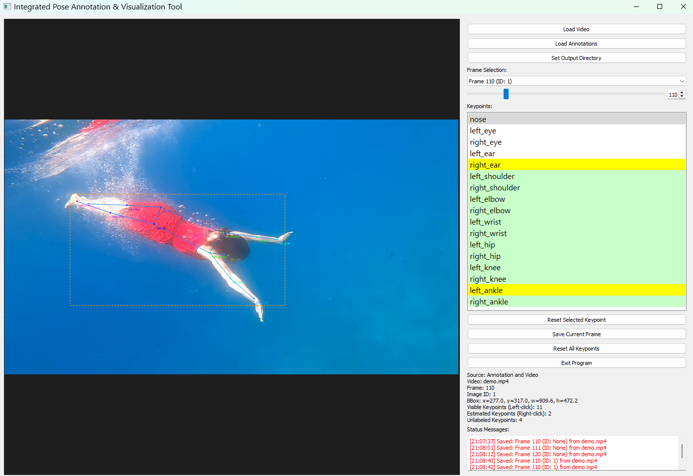

# Video Pose Annotation Tool

A lightweight, privacy-focused tool specifically designed for annotating single subject's 2D pose in videos. This tool is particularly suited for behavioral studies, offering direct video frame annotation capabilities and smart features to avoid redundant labeling across multiple videos. Current setting is for COCO17 skeleton, but other human/animal skeleton can be applied easily.


*Main interface showing keypoint annotation, skeleton visualization, and control panel*

## Why Choose This Tool?

- **Video-Centric**: Directly works with video files, automatically extracting frames for annotation
- **Smart Organization**: 
  - Supports multiple videos in the same annotation project
  - Helps avoid duplicate labeling of same frame from the same videos
  - Maintains clear source tracking for each annotated frame
- **Privacy First**: Runs completely locally - perfect for sensitive behavioral study data
- **Research-Oriented**: 
  - Designed for behavioral studies
  - Efficient workflow for frame-by-frame analysis
  - Clear visualization of pose progression
- **Customizable**: Define your own skeleton structure and keypoint configurations
- **Lightweight**: Minimal dependencies, quick setup, runs smoothly on standard hardware

The tool follows the COCO format standard while providing specialized features for video-based pose annotation.

## Features

- Interactive visualization of pose keypoint annotations
- Support for COCO format JSON annotations
- Configurable keypoint and skeleton definitions
- Real-time visualization of:
  - Keypoints with visibility states
  - Skeleton connections
  - Bounding boxes
  - Frame-specific information
- Zoom and pan capabilities
- Dark mode interface for better visibility

## Requirements

```
python >= 3.6
PyQt5
opencv-python
numpy
```

## Project Structure

```
pose_annotation_tool/
├── pose_config.py        # Configuration management
├── annotation_gui.py     # Main GUI application
├── README.md            # This documentation
└── frames/              # Directory for frame images
```

## Installation

1. Clone the repository
```bash
git clone https://github.com/Sooophy/human_pose_annotator.git
```
2. Install dependencies:
```bash
pip install -r requirements.txt
```

## Usage

### Getting Started

1. Launch the application:
```bash
python annotation_gui.py
```

2. Video Loading:
   - Click "Load Video" to select your video file(s)
   - The tool will automatically:
     - Extract frames from the video
     - Create a unique identifier for each video
     - Organize frames in the project directory
   - Multiple videos can be loaded into the same project
   - Previously extracted frames are detected to avoid duplication

3. Project Management:
   - Each video maintains its own metadata
   - Annotations are saved in a single COCO format JSON file
   - Frame sources are tracked by video identifier
   - Smart detection of similar poses across videos helps avoid redundant labeling

### Basic Interface Layout

1. Top Control Buttons:
   - "Load Video": Select video file to annotate
   - "Load Annotations": Import existing annotations
   - "Set Output Directory": Choose save location

2. Frame Navigation:
   - Slider bar for video frame navigation
   - Frame number display and input
   - Frame Selection area above slider

3. Keypoint List:
   - Complete list of keypoints to annotate
   - Arranged in anatomical order from head to feet
   - Left/right pairs grouped together

4. Bottom Control Buttons:
   - "Reset Selected Keypoint"
   - "Save Current Frame"
   - "Reset All Keypoints"
   - "Exit Program"

### Keypoint Annotation

1. Basic Controls:
   - Left-click: Place or move visible keypoints
   - Right-click: Place or move estimated/occluded keypoints
   - "Reset Selected Keypoint": Clear current keypoint
   - "Reset All Keypoints": Clear all keypoints in current frame
   - "Save Current Frame": Save your annotations

2. Visibility States:
   - Left-click points: Fully visible keypoints
   - Right-click points: Estimated/occluded keypoints
   - Unlabeled: Points not yet marked

3. Keypoint List Interface:
   - Visual status indication:
     * White background: Unlabeled points
     * Green highlight: Labeled points (visible, left-click)
     * Yellow highlight: Estimated points (occluded, right-click)
   - Complete list of keypoints:
     * nose
     * left_eye, right_eye
     * left_ear, right_ear
     * left_shoulder, right_shoulder
     * left_elbow, right_elbow
     * left_wrist, right_wrist
     * left_hip, right_hip
     * left_knee, right_knee
     * left_ankle, right_ankle
   - List updates in real-time as you label points
   - Provides immediate visual feedback of labeling progress
   - Helps track which points still need to be labeled

4. Status Display:
   ```
   Source: Video only (not annotated)/annotaiton only/both video and annotations
   Video: [filename].mp4
   Frame: [number]
   Image: [status]
   BBox: x=0.0, y=0.0, w=0.0, h=0.0
   Visible Keypoints (Left-click): [count]
   Estimated Keypoints (Right-click): [count]
   Unlabeled Keypoints: [remaining count]
   ```
   - Fully visible (v=2): Solid color
   - Occluded (v=1): Semi-transparent
   - To mark point as occluded:
     1. Right-click on the point
     2. Select "Mark as Occluded" from context menu

### Saving Your Work

**Important: Frames are NOT auto-saved!**

1. Saving Annotations:
   - You must explicitly click "Save Current Frame" to save your work
   - Changes are not automatically saved when:
     * Switching between frames
     * Moving to a different video
     * Closing the program
   - Make sure to save your work before:
     * Moving to another frame
     * Exiting the program
     * Taking long breaks

2. Best Practices:
   - Save after completing each keypoint set
   - Verify your save in the metadata display

3. Output Management:
   - Use "Set Output Directory" to specify where annotations are saved
   - Annotations are saved in COCO format JSON
   - Each save updates the annotation file with current frame data

### Understanding the Interface

1. Main Display:
   - Keypoints: Colored dots with labels
   - Skeleton: Blue lines connecting keypoints
   - Bounding box: Orange dashed line

2. Information Panel:
   - Displays frame metadata (video source, frame number)
   - Shows current bounding box coordinates
   - Tracks keypoint statistics (visible, estimated, unlabeled)
   - Updates in real-time as you annotate

3. Status Messages:
   - Bottom status bar shows saving history with time, frame, video souce, and imageID (if updating)
     Note: new frame saving will show the ID as None, and updated frame saving will show the imageID in the annotation


## Configuration

The `pose_config.py` module allows customization of:
- Keypoint definitions
- Skeleton connections
- Color schemes
- Default paths and settings

Example configuration (COCO17):

```python
KEYPOINT_NAMES = [
    "nose", "left_eye", "right_eye", "left_ear", "right_ear",
    "left_shoulder", "right_shoulder", "left_elbow", "right_elbow",
    "left_wrist", "right_wrist", "left_hip", "right_hip",
    "left_knee", "right_knee", "left_ankle", "right_ankle"
]

SKELETON_CONNECTIONS = [
    [1, 2], [1, 3], [2, 4], [3, 5],  # Head
    [6, 8], [8, 10], [7, 9], [9, 11],  # Arms
    [12, 14], [14, 16], [13, 15], [15, 17]  # Legs
]
```

## Visualization Features

- **Keypoints**: 
  - Visible keypoints shown in full color
  - Labeled but invisible keypoints shown with transparency
  - Each keypoint labeled with its name
  
- **Skeleton**: 
  - Connections between keypoints shown in light blue
  - Only drawn when both connected keypoints are visible
  
- **Bounding Box**:
  - Dashed orange line
  - Coordinates displayed in info panel

- **Information Panel**:
  - Frame number
  - Image ID
  - Bounding box coordinates
  - Keypoint visibility statistics

## Implementation Details

### Bounding Box Configuration
- Default padding: 30 pixels around the keypoint extremes
- Padding is applied in the `calculate_bbox` method:
```python
def calculate_bbox(self):
    """Calculate bounding box from keypoints"""
    if not self.keypoints:
        return None
        
    valid_x = [x for x, y, v in self.keypoints.values()]
    valid_y = [y for x, y, v in self.keypoints.values()]
    
    if valid_x and valid_y:
        x_min, x_max = min(valid_x), max(valid_x)
        y_min, y_max = min(valid_y), max(valid_y)
        
        # Add padding to make box slightly larger than the keypoints
        padding = 30  # Modify this value to adjust bounding box size
        x_min -= padding
        y_min -= padding
        x_max += padding
        y_max += padding
```
- The padding ensures the bounding box extends beyond the keypoints for better visibility
- You can modify the `padding` variable in the method to adjust the box size

### Annotation Capabilities
- **Dual Mode Operation**:
  - Visualization mode: Display existing annotations
  - Labeling mode: Create or modify keypoint annotations
- Each keypoint can be:
  - Labeled as visible (v=2)
  - Labeled but marked as occluded (v=1)
  - Unlabeled (v=0)

### Metadata Handling
The tool displays and processes various metadata:
- Frame Information:
  ```json
  {
    "id": "unique_image_id",
    "frame_number": "sequential_number",
    "file_name": "image_file_name",
    "width": "image_width",
    "height": "image_height"
  }
  ```
- Annotation Information:
  ```json
  {
    "image_id": "corresponding_image_id",
    "category_id": "person_category",
    "bbox": [x, y, width, height],
    "keypoints": [x1, y1, v1, x2, y2, v2, ...]
  }
  ```

### Source Identification Logic
The tool employs a hierarchical system to identify and match frames and keypoints:

1. **Frame Source Detection**:
   - Checks for frames in default directory (./frames)
   - Looks for frames relative to annotation file location
   - Allows manual directory selection if not found

2. **Keypoint-Frame Matching**:
   - Matches frames to annotations using image_id
   - Validates frame numbers against video sequence
   - Handles both video-extracted frames and individual images

3. **Data Validation**:
   - Ensures frame numbers are sequential
   - Validates keypoint coordinates against image dimensions
   - Verifies consistency between frame and annotation metadata

## Contributing

Feel free to submit issues and enhancement requests.

## License

The MIT License (MIT)

Copyright (c) 2011-2025 The Bootstrap Authors

Permission is hereby granted, free of charge, to any person obtaining a copy
of this software and associated documentation files (the "Software"), to deal
in the Software without restriction, including without limitation the rights
to use, copy, modify, merge, publish, distribute, sublicense, and/or sell
copies of the Software, and to permit persons to whom the Software is
furnished to do so, subject to the following conditions:

The above copyright notice and this permission notice shall be included in
all copies or substantial portions of the Software.

THE SOFTWARE IS PROVIDED "AS IS", WITHOUT WARRANTY OF ANY KIND, EXPRESS OR
IMPLIED, INCLUDING BUT NOT LIMITED TO THE WARRANTIES OF MERCHANTABILITY,
FITNESS FOR A PARTICULAR PURPOSE AND NONINFRINGEMENT. IN NO EVENT SHALL THE
AUTHORS OR COPYRIGHT HOLDERS BE LIABLE FOR ANY CLAIM, DAMAGES OR OTHER
LIABILITY, WHETHER IN AN ACTION OF CONTRACT, TORT OR OTHERWISE, ARISING FROM,
OUT OF OR IN CONNECTION WITH THE SOFTWARE OR THE USE OR OTHER DEALINGS IN
THE SOFTWARE.

## Acknowledgments

This tool uses the COCO keypoint format standard for human pose estimation.